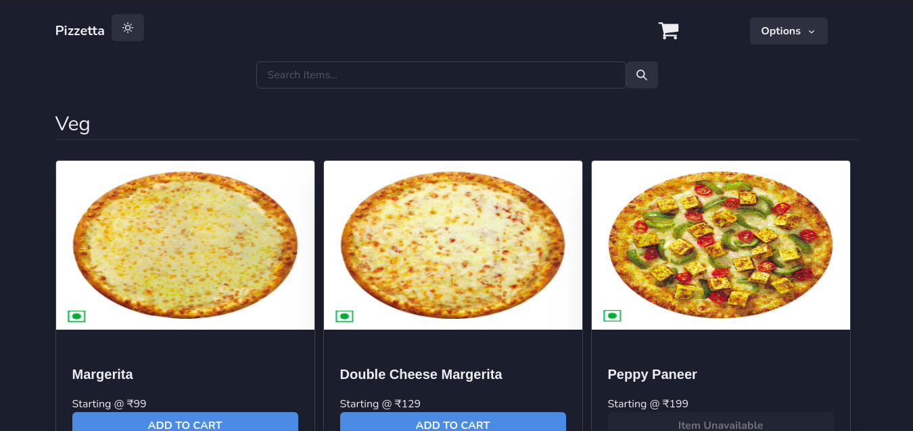
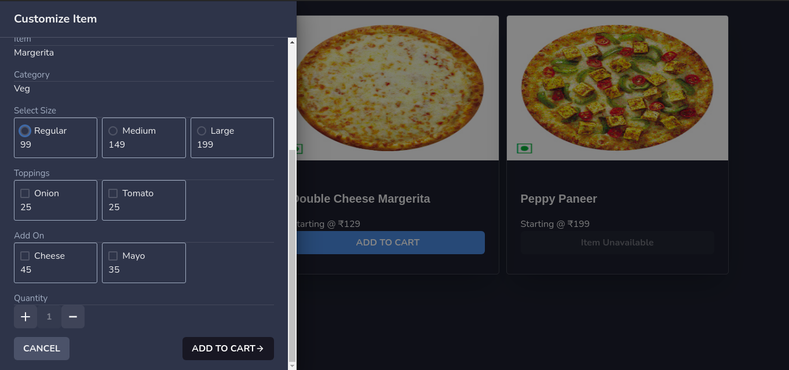
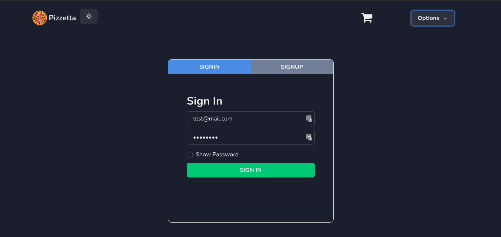
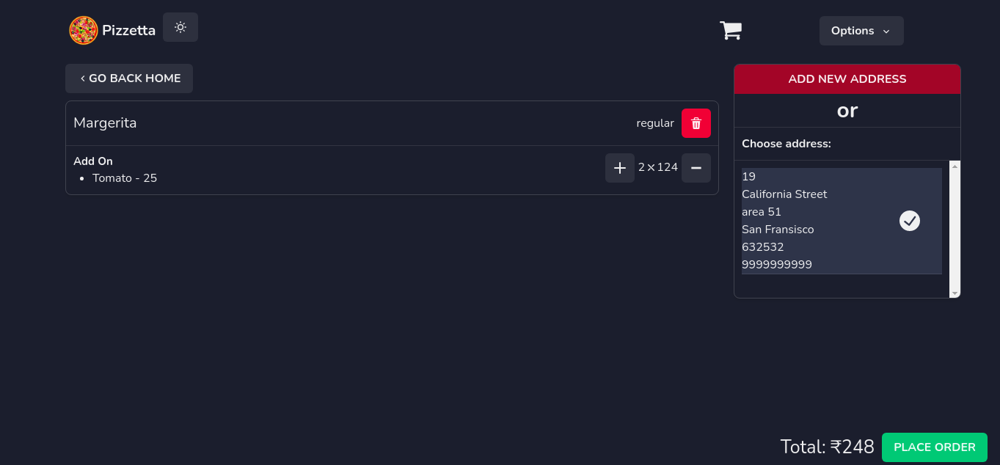
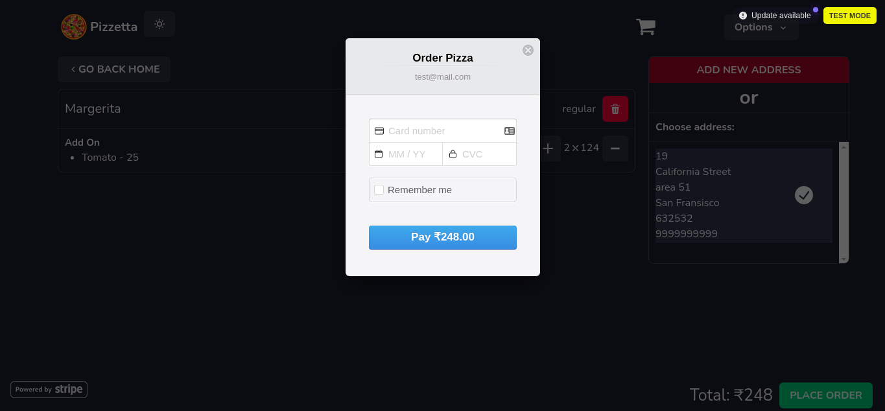
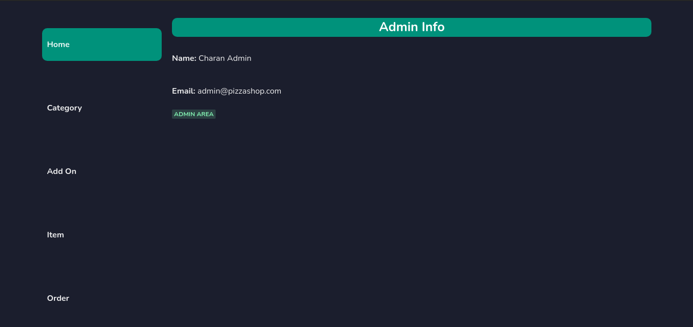
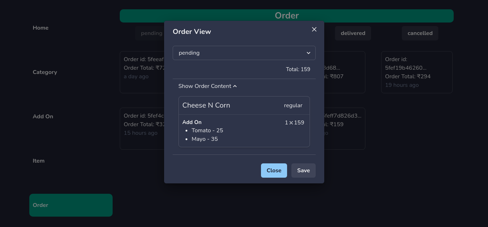

# Pizza store

A friendly food ordering website for your neighborhood pizza store.

### **Stack used:**  
* MongoDB(Mongoose with MongoDB atlas)  
* Nodejs with Express  
* React with Context API  

### **Libraries & Frameword used in detail:**  
**Front-End**  
* react  
* react-router-dom  
* chakra-UI  
* moment  
* react-fontawesome  
* react-images-upload  
* react-stripe-checkout  
* use-state-with-callback  
* uuid  
* axios  

**Back-End**  
* express  
* mongoose  
* cookie-parser  
* jsonwebtoken  
* @hapi/joi  
* bcryptjs  
* multer  
* path  
* stripe  
* uuid  

### **Screenshots of the store:**

**Home/Landing Page**

**Item Customization**

**Sign in page**

**Cart Page**

**Payment with stripe**

**Admin Home**

**Admin Home**

**Admin Item Manage**

**Admin Order Manage**

### TODOs
- [ ] Make admin to edit the item info
- [ ] Show user all of their orders in order page along with status
- [ ] Finish UP
